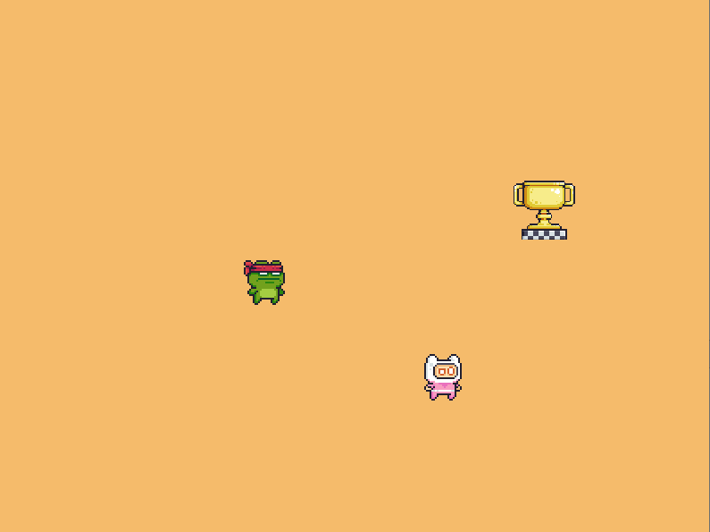
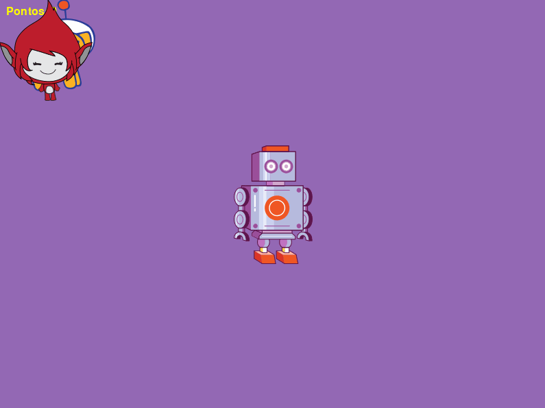

# Pygame Zero - Sesc-SP

Exercícios do curso de introdução a jogos básicos em Python com Cristiano Tito

# Aula 1
Introdução ao Pygame Zero

# Aula 2
- update()
- colliderect()
- keyboard

# Aula 3
- score
- game over
- schedule
- mouse-up/down

# Aula 4
- life
- sound

# Trabalho Final - Flappy Game
- level
- Python Lists

# Assets - Copyright
### Sprites
[Pixel Adventure by Pixel Frog](https://pixelfrog-assets.itch.io/pixel-adventure-1)

[Forest Background by edermunizz](https://edermunizz.itch.io/free-pixel-art-forest)

### Helper

[A Posteriori](https://www.aposteriori.com.sg/pygame-zero-helper/)

### Fonte

[Pixellari by Zacchary Dempsey-Plante](https://github.com/zedseven/Pixellari)

### Sound FX

[Interface SFX Pack 1 by ObsydianX](https://obsydianx.itch.io/interface-sfx-pack-1)

### Trilhas Sonoras

[RPG Music Pack by SVL](https://svl.itch.io/rpg-music-pack-svl)

### Exercício Flappy Diver

Scratch