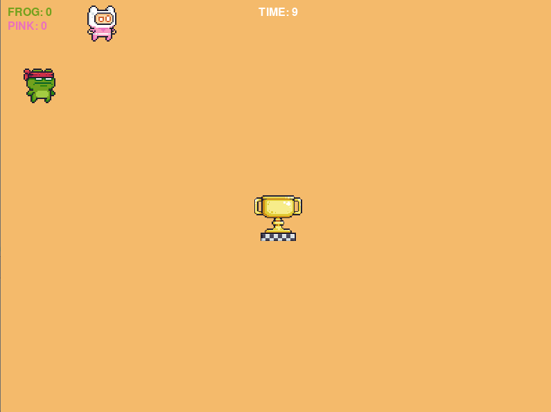

# Pygame Zero - Sesc-SP

Exercícios do curso de introdução a jogos básicos em Python com Cristiano Tito

## Copyright - Imagens
Scratch e rawpixel.com/Freepik (aula 4)

# Aula 1
Introdução ao PyGmae Zero

# Aula 2
- update()
- colliderect()
- keyboard

# Aula 3
- score
- life
- game over
- schedule
- mouse-up/down

 

# Aula 4 - Trabalho final
- sound
- list

